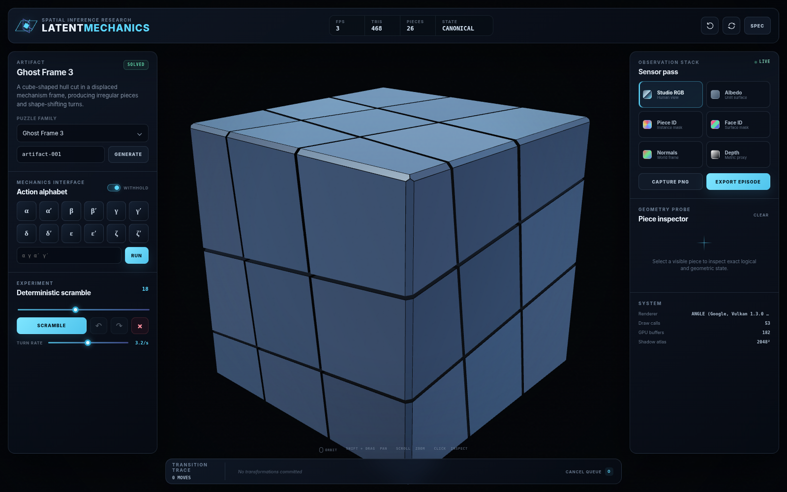
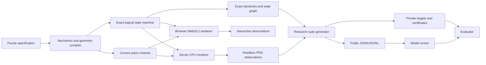

# KineScope

**Open research infrastructure for visual system identification, active inference, abstraction, and planning in unfamiliar 3D mechanisms.**

KineScope is a deterministic simulation, rendering, dataset-generation, and evaluation platform built around non-standard twisty puzzles. The puzzles are useful because they expose a difficult combination of 3D object permanence, hidden transition rules, state-dependent legality, active experiment design, symbolic abstraction, and long-horizon planning. The intended scientific object is not “Rubik's Cube solving.” It is whether multimodal agents can infer the latent mechanics of an unfamiliar spatial system and transfer that model beyond familiar appearances.



The platform deliberately separates four layers:

1. **Canonical mathematical object:** exact `(B, Φ, β)` affine geometry plus exact integer-valued rigid state.
2. **Geometry:** exact rational chambers, bond-quotiented pieces, provenance, and deterministic triangulations.
3. **Observations:** synchronized human-oriented and machine-oriented render channels.
4. **Research harness:** public/private episodes, task generation, diagnostics, scoring, provenance, JSON/JSONL output, and a stateless REST API.

Pixels may observe state. Pixels never define state. This rule prevents the benchmark from quietly becoming an assay of renderer bugs, a surprisingly popular genre of accidental research.

## What is implemented

### Exact mechanics and procedural artifacts

- Exact rational affine-convex compiler with canonical hashes, diagnostics, certificates, and an independent verifier.
- Atomic chambers, exact adjacency, physical-piece bond quotient, raw traces, and face provenance.
- Cubic logical lattices from `2×2×2` through `9×9×9`.
- Exact quarter-turn transitions using integer 3×3 signed-permutation matrices.
- Deterministic replay, serialization, transactional previews, undo/redo, and invariant validation.
- Convex half-space geometry, custom outer hulls, chamfers, rotated/offset mechanism frames, and Ghost-Cube-like shape modification.
- Custom action alphabets, exterior or interior logical layers, deterministic procedural “alien artifact” presets, and appearance/mechanics interventions.
- Face-connected rigid bandages with exact state-dependent legality, blocked-action reports, and legal-only deterministic scrambles.

### Synchronized rendering

- Interactive WebGL2 laboratory for human inspection.
- Deterministic dependency-free CPU rasterizer for server-side and headless generation.
- Six channels from one state and camera:
  - `studio`
  - `albedo`
  - `piece`
  - `face`
  - `normal`
  - `depth`
- PNG output, exact camera metadata, segmentation legends, visible-piece statistics, pixel statistics, and deterministic image digests.

### Research suite

KineScope currently generates and evaluates **16 task families**:

- state tracking
- piece trajectory and object permanence
- inverse dynamics
- action legality
- action order
- commutation
- symbolic mechanics induction
- active mechanics identification
- counterfactual rollout
- transition validity
- planning
- viewpoint invariance
- appearance–mechanics disentanglement
- constraint localization
- reachability
- uncertainty calibration

The suite also supports eight named development/evaluation splits, including appearance OOD, geometry OOD, mechanics OOD, compositional OOD, and adversarial controls.

For every generated suite, KineScope can emit:

- public interaction episodes;
- evaluator-private exact episodes;
- public benchmark items;
- private targets and verification certificates;
- geometry and topology analyses;
- bounded exact state graphs;
- action-order, cycle, successor, and commutation analyses;
- candidate-mechanics hypotheses and exact information-gain rankings;
- evaluation reports with per-item, per-task, per-split, calibration, latency, token, and cost statistics;
- canonical JSON, JSONL partitions, stable deterministic digests, PNGs, and ZIP-compatible file maps.

See [RESEARCH_SUITE.md](docs/RESEARCH_SUITE.md) for the complete data model.

## Quick start

Requirements: Node.js 20+ and, for the interactive interface, a browser with WebGL2.

```bash
npm run check
npm run serve
```

Run `npm run typecheck` when TypeScript is installed in the development environment.

Open:

```text
http://127.0.0.1:4173
```

The same process serves the browser laboratory and REST API:

```text
http://127.0.0.1:4173/api/v1/health
```

There is no runtime dependency tree. Apparently a JavaScript project can exist without downloading a geological formation called `node_modules`.

See [Implementation Phase 1](docs/IMPLEMENTATION_PHASE_1.md) for the exact compiler contract and its deliberately narrow boundary.

## REST API

The API is stateless: requests carry a preset or full puzzle specification and, where relevant, a serialized exact state. That makes jobs reproducible, parallelizable, and easy to call from Python, model-evaluation workers, or a cluster.

### Health and capabilities

```bash
curl http://127.0.0.1:4173/api/v1/health
curl http://127.0.0.1:4173/api/v1/capabilities
curl http://127.0.0.1:4173/api/v1/openapi.json
curl http://127.0.0.1:4173/api/v1/schemas
```

### Exact transition

```bash
curl -X POST http://127.0.0.1:4173/api/v1/state/create \
  -H 'content-type: application/json' \
  -d '{"preset":"bandaged-relay-3","scrambleDepth":3,"seed":"paper-001"}'
```

Send the returned `state` to `/api/v1/state/transition` or `/api/v1/state/rollout`.

### Server-side observation

```bash
curl -X POST 'http://127.0.0.1:4173/api/v1/render?format=png' \
  -H 'content-type: application/json' \
  -d '{
    "preset":"ghost-3",
    "sequence":["R","U"],
    "mode":"normal",
    "width":512,
    "height":512,
    "format":"png"
  }' \
  --output normal.png
```

Use `"format":"json"` to receive a base64 PNG and dense render metadata in one response.

### Generate a benchmark suite

```bash
curl -X POST http://127.0.0.1:4173/api/v1/suite/generate \
  -H 'content-type: application/json' \
  -d '{
    "seed":"neurips-v1",
    "splits":["validation","test-iid","test-mechanics-ood"],
    "episodesPerSplit":2,
    "horizon":6,
    "scrambleDepth":4,
    "includeDiagnostics":true
  }' \
  --output suite.json
```

The API also exposes compilation, exact dynamics, bounded graph exploration, active-experiment ranking, episode generation, evaluation, and batched operations. See [API.md](docs/API.md) and [DEPLOYMENT.md](docs/DEPLOYMENT.md).

## CLI research workflow

```bash
# Platform capability manifest
npm run research:manifest -- --output validation/platform-manifest.json

# Dense geometry/mechanics diagnostics
npm run research:analyze -- ghost-3 paper-seed --output validation/ghost-analysis.json

# Bounded exact state graph
npm run research:graph -- bandaged-relay-3 paper-seed \
  --max-states 512 --max-depth 5 \
  --output validation/bandaged-graph.json

# Full public/private benchmark suite plus JSONL partitions
npm run research:suite -- \
  --seed paper-v1 \
  --splits validation,test-iid,test-geometry-ood,test-mechanics-ood \
  --episodes-per-split 2 \
  --horizon 6 \
  --scramble-depth 4 \
  --output datasets/paper-v1 \
  --monolithic

# Score model predictions
npm run research:evaluate -- \
  --suite datasets/paper-v1/suite.json \
  --predictions runs/model-a/predictions.jsonl \
  --output runs/model-a/evaluation.json \
  --strict
```

A generated dataset directory has this shape:

```text
datasets/paper-v1/
├── manifest.json
├── suite.json
├── public/
│   ├── episodes.jsonl
│   └── items.jsonl
└── private/
    ├── episodes.jsonl
    ├── targets.jsonl
    └── diagnostics.jsonl
```

The private partition contains canonical puzzle specifications, action aliases, exact states, trajectories, dynamics, and verification data. Do not hand it to the model unless the experiment is specifically measuring how well a system performs after receiving the answers, which would certainly improve the benchmark numbers.

## Browser capabilities

After the `kinescope:ready` event, the page exposes:

- `window.kineScopeAgent`: narrow benchmark-facing capability.
- `window.kinescope`: evaluator/developer capability with exact access.

Agent-side interaction:

```js
const observation = window.kineScopeAgent.observe();
await window.kineScopeAgent.act('A2', { animated: false });
window.kineScopeAgent.requestView({
  yawDelta: 0.4,
  pitchDelta: -0.15,
  distanceScale: 0.95,
});
const image = await window.kineScopeAgent.capture('studio', {
  width: 768,
  height: 768,
});
```

Evaluator-side control:

```js
await window.kinescope.applySequence("R U R' U'", { animated: false });
const state = window.kinescope.getState();
const truth = window.kinescope.getGroundTruth();
const dynamics = window.kinescope.analyzeDynamics({ maxOrder: 32 });
const image = await window.kinescope.capture('piece', {
  width: 1024,
  height: 1024,
});
```

With mechanics withheld, the agent receives neutral actions such as `A0…A5`, generic artifact metadata, and an opaque state fingerprint. It does not receive the exact puzzle specification, canonical action map, piece transforms, legality mask, reset, or dynamics oracle. A blocked hidden action raises `KineScope_ACTION_REJECTED` without leaking which rigid cluster caused it.

The legacy names `window.twistyAgent`, `window.twistyWorld`, and `twistyworld:ready` remain temporarily available as deprecated aliases for old harnesses.

## Core library

```js
import {
  analyzeCurrentDynamics,
  compilePuzzle,
  createPreset,
  generateResearchSuite,
  PuzzleEngine,
} from './src/core/index.js';

const spec = createPreset('bandaged-relay-3');
const puzzle = compilePuzzle(spec);
const engine = new PuzzleEngine(puzzle);

engine.scramble(40, 'exact-state-seed');
console.log(engine.validate());
console.log(engine.groundTruth());
console.log(analyzeCurrentDynamics(engine));

const suite = generateResearchSuite({
  seed: 'pilot-v1',
  splits: ['validation', 'test-mechanics-ood'],
  episodesPerSplit: 2,
});
console.log(suite.suiteDigest);
```

## Architecture



More detail lives in [ARCHITECTURE.md](docs/ARCHITECTURE.md).

## Validation

```bash
npm run check
npm run typecheck
npm run build
npm run browser:smoke
```

The deterministic Node suite covers exact algebra, state restoration, invalid transition rejection, state-dependent bandages, procedural geometry, machine-label stability, dynamics analysis, state graphs, mechanics-hypothesis ranking, public/private leakage boundaries, all 16 generated tasks, evaluation, the CPU PNG renderer, and REST API behavior.

See [VALIDATION.md](docs/VALIDATION.md) for the release record and [ROADMAP.md](docs/ROADMAP.md) for the honest boundary between what is implemented and what the laws of geometry are still demanding from us.

## Current scope boundary

KineScope currently assumes cubic logical lattices, quarter-turn generators, and convex cells. It does not yet provide general tetrahedral/dodecahedral cut complexes, jumbling moves, continuous swept-volume collision checks, lock-and-key predicates, non-convex decomposition, metric robot contact physics, or photoreal path tracing. Those are architectural extensions, not hidden claims smuggled into a glossy screenshot.

## License and citation

The source is available under the MIT License. Citation metadata is in [`CITATION.cff`](CITATION.cff).
