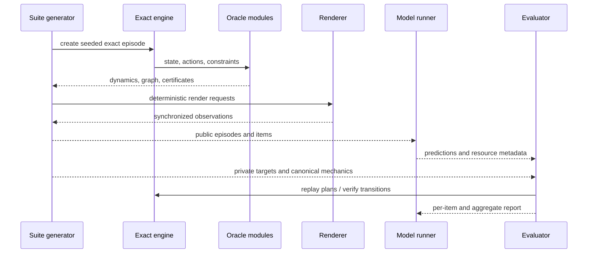

# Architecture

KineScope is split into a deterministic research core and replaceable observation/execution layers. The central rule is:

> **Pixels may observe exact state, but pixels may never define exact state.**

## Layer model

```text
Puzzle specification
    ↓
Compiler
    ├── canonical logical mechanism
    ├── convex piece geometry
    ├── action generators
    ├── rigid constraints
    └── appearance metadata
          ↓
Exact state engine
    ├── state transitions
    ├── legality
    ├── serialization
    ├── replay / undo / redo
    ├── state fingerprints
    └── ground truth
          ↓
Research oracles
    ├── dynamics analysis
    ├── bounded state graphs
    ├── mechanics hypotheses
    ├── information-gain ranking
    └── verification certificates
          ↓
Observation layers
    ├── browser WebGL2 renderer
    └── deterministic server CPU renderer
          ↓
Research harness
    ├── public/private episodes
    ├── benchmark tasks and splits
    ├── JSON/JSONL materialization
    ├── REST API
    └── evaluator
```

## Exact state representation

Every logical piece has:

- immutable piece identity;
- home coordinate;
- current coordinate;
- current 3×3 signed-permutation orientation.

Quarter-turn actions apply integer coordinate permutations and exact orientation multiplication. No floating-point pose is used to determine occupancy, solved state, legality, or reachability. Floating point appears only in geometry construction, camera projection, shading, and animation.

A serialized state carries a schema version, puzzle identity, exact piece transforms, history, future, engine version counter, and deterministic hash. The loader validates puzzle compatibility and invariants before committing, so a forged or stale state does not partially mutate the engine.

## Geometry compiler

The compiler intersects:

1. an arbitrary bounded convex outer hull; and
2. half-spaces induced by each logical cell in a translated and rotated mechanism frame.

This produces convex polyhedra for each logical cell. The compiler derives faces, vertices, triangles, volume, centroid, exposed outer area, adjacency, machine IDs, materials, and topology diagnostics.

Rigid bandages are validated as non-overlapping six-neighbor connected cell clusters. Their legality is evaluated from current exact coordinates: every cluster must be wholly selected or wholly unselected by an action.

## Renderer separation

### Browser renderer

The WebGL2 renderer provides interactive camera control, animation, picking, lighting, studio presentation, and synchronized offscreen channels.

### Server renderer

The CPU renderer performs deterministic triangle projection, z-buffering, channel shading, and PNG encoding without browser automation. It is intended for API calls, CI, dataset workers, and environments where launching Chromium merely to obtain a depth image would be an impressive use of machinery.

Both renderers consume the same compiled geometry and exact engine transforms.

## Research data flow



## Capability boundaries

The browser exposes two frozen objects:

```text
window.kineScopeAgent
```

Agent-facing methods:

- observe;
- list opaque/disclosed actions;
- act / actSequence;
- request bounded camera changes;
- select observation mode;
- capture an observation.

```text
window.kinescope
```

Evaluator/developer methods additionally include:

- exact state and ground truth;
- canonical puzzle specification;
- exact action list and legality inspection;
- dynamics analysis;
- reset, undo, redo, scramble;
- preset/specification replacement;
- public/private episode bundle export.

This is a capability split, not a claim that JavaScript can hide secrets from hostile code executing in the same page. A proper benchmark runner exposes only the narrow object to the policy and retains evaluator capabilities in a separate process.

## Server architecture

The REST layer is a thin Fetch-style handler over pure modules. Requests are stateless and carry their puzzle specification and serialized state. Vercel adapters and the local Node server both call the same `handleApiRequest` function.

Advantages:

- deterministic replay;
- horizontal parallelism;
- no session affinity;
- reproducible failures;
- simple batch workers;
- clean public/private orchestration.

The practical cost is request payload size. Large suites belong in artifact storage and JSONL files; the API is best used for generation jobs, exact transitions, diagnostics, and observations rather than repeatedly mailing the entire scientific archive back and forth.

## Provenance and digests

Canonical JSON recursively sorts object keys and normalizes values before hashing. Stable prefixed digests identify:

- public and private episodes;
- suites;
- geometry reports;
- state graphs;
- evaluation reports;
- render outputs;
- public state fingerprints.

Generation timestamps are intentionally nullable in deterministic artifacts. A separate run manifest may record wall-clock execution metadata without contaminating the identity of the underlying benchmark.
